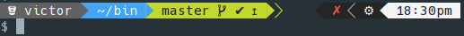
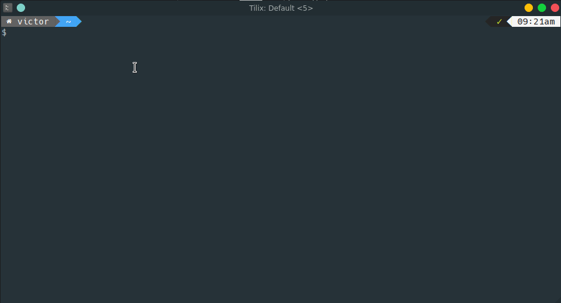

# powerline-2column
A simple powerline prompt for Bash with 2 columns (no python)



The prompt provides the following information:

**Left Side**
- Folder icon for:
  - Git folder with provider icon
  - Home folder
  - Dropbox folder
- Username
- Hostname (when connecting via SSH)
- Current path
- Git status
  - untracked
  - uncommited
  - ahead/behind

**Right Side**
- Previous exit code
- Battery status
- sudo cached credentials
- Time



* * *

#### Folder Icon

Changes according to current path.

**Normal Folder**


**Home Folder**


**Git Folder (no provider)**


**Bitbucket**


**GitHub**


**Dropbox**


#### SSH Info

Shows hostname when connecting via SSH.


#### Git Info

Shows git information on prompt.

1 untracked file and 1 uncommitted change.


All work is committed and pushed.


Work is committed and ahead of remote.


#### Exit Code

**exit 0**


**exit non zero**


#### Sudo status

Indicates cached sudo password.


Installation
---

Download `powerline-2column.bash` to your machine (optionally make it hidden) and source it on your `${HOME}/.bashrc`.

```
. ${HOME}/.powerline-2column.bash
```

#### Requirement

Additional fonts needed.

**Arch**

```
community/powerline-fonts
aur/nerd-fonts-complete
```

**Ubuntu**

```
apt install fonts-powerline
** nerd-fonts
```

Additional Options
---

You can also disable the battery and sudo info display by changing the two values to `n` in the script.

```
battery_info="y"
sudo_info="y"
```
